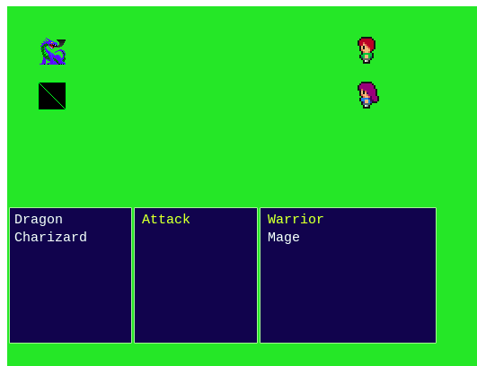

# JS-RPG-GAME
- This is a simple javascript Turn-based RPG game built with Phaser 3 JS Library


## Project Details - Game Design
- Designing of the tilemap which composes of three layers one for the backgound, obstacles and point for battles.
   
   

- The game was developed following fundamental Game Design principles, applying them, and building a formal Game Design Document.

## How to play
- The game entails moving the game character to the following points in the map using keyboard arrow keys.

     

- This will initiate the fight scene where the  game characters will battle each other.

     

- Use space to attack the enemy character and yoou will view the progress of the game. 

## Testing Instructions
To run the test use the following command: 

```npm run test``` 


## Built With

- HTML5
- Javascript
- Phaser
- ES6
- Jest for Testing
- Webpack
- Tiled

## Live Demo


## Authors

👤 **Hillarioh Okerio**

- Github: [@hillarioh](https://github.com/hillarioh)
- Twitter: [@hillaokri](https://twitter.com/hillaokri)
- Linkedin: [Hillarioh Okerio](www.linkedin.com/in/hillaryokerio)
- Email: (okerioh@gmail.com)

## 🤝 Contributing

Contributions, issues and feature requests are welcome!

## Show your support

Give a ⭐️ if you like this project!

## 📝 License

This project is [MIT](./LICENSE) licensed.
